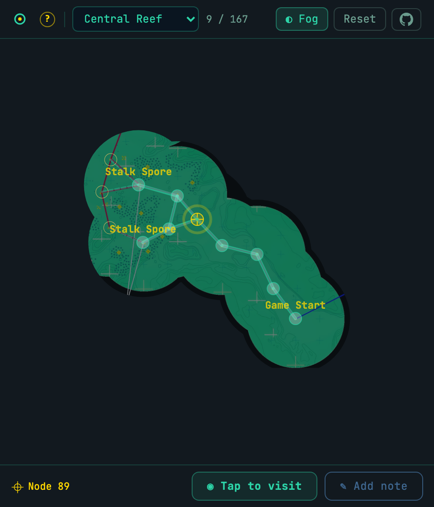

# In Other Waters: Map Tracker

**[Open the live map at csw.github.io/iow-map/][live]**

Interactive, incremental map tracker for [*In Other Waters*][game]. The game only shows you the immediate area you're in, and you have to keep track of the paths you've explored in your head. There are maps available, but seeing the whole map undermines the exploration aspect of the game. This tool reveals the map as you explore, and only shows you what you've seen, marking the paths you've taken. It also lets you track your current position and make notes.



The locations you've visited are stored in your browser.

This uses the excellent [maps](https://steamcommunity.com/sharedfiles/filedetails/?id=2784267318) created by, er, '[Hugh Janis](https://steamcommunity.com/profiles/76561198128927251)' and posted as a Steam community guide.

[game]: https://www.fellowtraveller.games/in-other-waters

## Quick Start

**Use live site**: Visit [csw.github.io/iow-map/][live].

**Use locally:** Open `index.html`.

### Controls

- **Tap** a frontier node (orange outline) to visit it
- **Drag** to pan, **pinch** to zoom
- **Fog toggle** reveals/hides unexplored areas
- **Note mode** lets you annotate any node
- **Undo** reverts the last action (30-deep stack)

## Building from Source

```bash
uv sync

# Add map images to maps/ directory, then:
just build-all
```

This runs the full pipeline: extract graphs from map images → apply manual corrections → generate `index.html`.

After editing `tools/app_template.html` or `tools/corrections.py`, skip re-extraction with `just build`.

See `docs/HANDOFF.md` for full architecture documentation.

## Project Structure

| Path | Description |
|------|-------------|
| `index.html` | GitHub Pages app (relative `maps/` paths) |
| `tools/corrections.py` | **Source of truth** for all manual adjustments and metadata |
| `tools/extract_graph.py` | Graph extraction: fuzzy select → skeletonize → Douglas-Peucker |
| `tools/build.py` | Master build script |
| `graphs/*.json` | Extracted + corrected graph data |

## Release

**GitHub Pages:** Push to main → auto-deploys.

## License

MIT

[live]: https://csw.github.io/iow-map/
